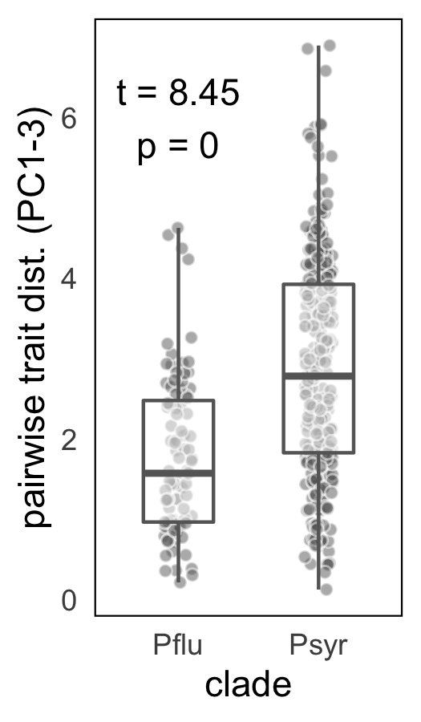

#### Multivariate pairwise trait distances by clade.
Results form Welch's two-sample unequal variance *t*-test:
<table class="table table-striped table-hover table-condensed" style="margin-left: auto; margin-right: auto;">
 <thead>
  <tr>
   <th style="text-align:right;"> estimate </th>
   <th style="text-align:right;"> estimate1 </th>
   <th style="text-align:right;"> estimate2 </th>
   <th style="text-align:right;"> statistic </th>
   <th style="text-align:right;"> p.value </th>
   <th style="text-align:right;"> parameter </th>
   <th style="text-align:right;"> conf.low </th>
   <th style="text-align:right;"> conf.high </th>
   <th style="text-align:left;"> method </th>
   <th style="text-align:left;"> alternative </th>
  </tr>
 </thead>
<tbody>
  <tr>
   <td style="text-align:right;"> 1.119476 </td>
   <td style="text-align:right;"> 2.808813 </td>
   <td style="text-align:right;"> 1.689337 </td>
   <td style="text-align:right;"> 8.706653 </td>
   <td style="text-align:right;"> 0 </td>
   <td style="text-align:right;"> 214.855 </td>
   <td style="text-align:right;"> 0.8660418 </td>
   <td style="text-align:right;"> 1.37291 </td>
   <td style="text-align:left;"> Welch Two Sample t-test </td>
   <td style="text-align:left;"> two.sided </td>
  </tr>
</tbody>
</table>
 

