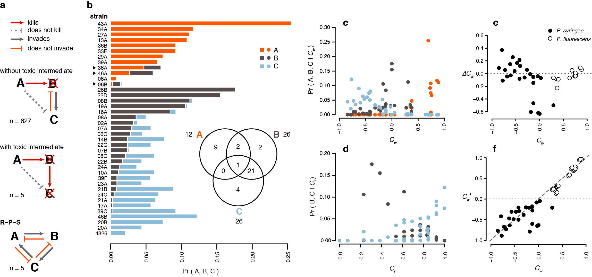

## Indirect effects of antibiotic production can neutralize competitive hierarchies among phyllosphere bacteria

#### Parris T. Humphrey1,2, Trang N. Nguyen2, Noah K. Whiteman1,2

1Organismic & Evolutionary Biology, Harvard University, Cambridge, MA 02138, USA 
2Integrative Biology, University of California, Berkeley, CA 94720, USA 
3Department of Plant Sciences, University of Arizona, Tucson, AZ 85721, USA

Corresponding author: PTH ([phumphrey@g.harvard.edu](phumphrey@g.harvard.edu))

### Abstract

Competition is rife within bacterial communities, but we poorly understand the traits that underlie various types of competitive fitness, the correlations among them, and their distributions in natural bacterial populations. In this study, we characterize the types and strengths of competitive interactions that occur among a suite of *Pseudomonas* spp. strains isolated from a native forb at a single field site. Outcomes from pairwise competitions in spatial microcosms revealed strong competitive dominance of *Pseudomonas fluorescens* strains over *P. syringae* strains. *P. fluorescens* strains were better resources competitors and more often produced antibiotics to which few *P. syringae* strains expressed resistance. Within each bacterial clade, growth rates of individual strains were not correlated with overall competitive ability or saturation density *in vitro*; however, *P. fluorescens* strains with shorter lag times *in vitro* were on average better competitors, suggesting that spatial preemption of a shared resource promoted competitive fitness in the context of our experiments. We then quantified how patterns of resistance among *P. syringae* to *P. fluorescens* secretions might influence relative competitive ranks *within* the *P. syrinage* clade. This analysis showed that a high proportion of competitive outcomes would be reversed in the presence of antibiotics produced by *P. fluorescens*, and these indirect benefits accrued most to strains of lower average competitiveness. Thus, *P. fluorescens* are not only potent direct competitors of putatively phytopathogenic *P. syringae* strains but can also indirectly change the outcome of a large number of competitive interactions among them when present within the same spatial context. Testing the relevance of these interaction types in the context of living plant tissues will help reveal the role of *P. fluorescens* in suppressing the growth and/or upending the fitness ranks of potentially phytopathogenic *P. syringae*.

**Keywords:** interference competition; species interactions; *Pseudomonas*; co-existence; facilitation

**Author contributions:** PTH and NKW designed the study; PTH and TNN collected the data; PTH wrote the manuscript with help from NKW.

### Introduction

Ecologists have long recognized that distinct forms of competition operate simultaneously within communities: competition to exploit shared resources, and competition to interfere with another species’ ability to do so. Competition of both sorts is a potent source of natural selection operating within microbial communities (Hibbing et al. 2009; Cornforth and Foster 2013; Mitri and Richard Foster 2013). Teasing apart how exploitative and interference competition interact in a community context remains a long-standing challenge (DeLong and Vasseur 2013).

### Materials & Methods

#### Bacterial strains

Of the 51 *Pseudomonas* spp. strains isolated from bittercress and described by Humphrey et al. (2014), we selected a set of 39 (26 *P. syringae*, 14 *P. fluorescens*) that represent the extent of observed diversity. The laboratory strain *P. syringae* pv. maculicola str. ES4326 (hereafter Psm4326) was used as a reference owing to its phylogenetic similarity to strains isolated from bittercress and its extensive characterization in the laboratory as a pathogen of *Arabidopsis thaliana* (Cui:2005dn, Cui:2002gp, Groen:2013bt, Groen:2015bv).

#### Competition assays

Pairwise competition assays were conducted on 1% agar MM plates (100 mm diameter) onto which we overlaid 4 ml of 0.5% soft agar MM containing a bacterial suspension of each resident strain inoculated at $5 \times 10^{5} \text{ml}^{-1}$ while soft agar was still molten ($\sim 42 \text{ C}$). Suspensions of each of the 40 invader strains were then spotted at the same concentration in 4 $\mu\text{L}$ aliquots spaced every 0.5 cm in parallel rows using an 8-channel pipettor. Plates were incubated face up for 12 h, followed by face down incubation at $28\text{ C}$ for 10 days. Megacolony spots were scored by hand for growth on days 1, 3, 5, 8, and 10. Data used for the following analyses are from day 10, by which time all interactions dynamics had reached equilibrium.

We scored growth of each invader as $0$ for no visible growth of the invader above a negative control spot containing MM alone, $0.5$ for a largely translucent 'megacolony', which reflected a definite presence of growth but which was relatively suppressed and confined to the megacolony margin, and $1$ for obvious and robust megacolony growth. Examples of each can be seen in Fig. S3. We scored inhibition interactions as the presence of a zone of clearance (halo) $\geq 1 \text{ mm}$ surrounding the extent of the invader megacolony (Fig. S3). Inhibition interactions were ultimately scored as 0 or 1 regardless of the spatial extent of the halo, although variation in halo width was recorded. We also scored any morphological variation among megacolonies for particular strains, and later we relate such variation for particular strains to the phylogenetic position of their competitors (see *Analyzing the distribution of competitive outcomes*, below).

#### Calculating indexes of competitiveness

Each strain was assayed under 40 different conditions both as resident strain and as invader, comprising an interaction network with 1600 entries (including self vs. self). One version of the interaction network represents the outcome of resource competition and details the extent of growth of each invader, while the other captures the presence or absence of inhibitory interactions indicated by zones of clearance in the resident population. For resource competitions, we calculate the invasiveness ($C_o$) and defense capacity (i.e. territoriality; $C_d$) of each strain. $C_o$ for each strain $i$ was calculated as $C_{o,i} = \frac{1}{n_{\text{ij}}}\sum_{i \neq j}^{n}x_{ij}$, where $x_{ij} \in \{ 0,0.5,1\}$ and $n_{ij}$ is the total number of scored interactions for each strain as the invader with all non-self resident strains. $C_o$ is thus the expected value of growth attained by each strain as the invader across the population of residents.

$C_d$ was calculated similarly except the focal strain $j$ is in the resident state, $x_{ji} \in \{ 0,0.5,1\}$ is as before but has a subscript reversal and indicates the degree to which the resident prevented the growth of each invader $i$, and $n_{ji}$ is the number of interactions occurring between each focal resident and its non-self invaders. $C_d$ can thus be interpreted as the expected amount of growth each resident strain can prevent among the population of invaders assayed. We calculated an overall exploitative competition index $C_w$ for each strain as $C_{o,i} - {(1 - C}_{d,i})$, where $-1 \leq C_{w} \leq 1$. These extremes represent absolute competitive inferiority ($-1$), where a strain failed to prevent any growth of any invader and similarly failed to invade any other strain, to absolute competitive dominance ($1$), where a strain fully invaded all residents and fully prevented growth of all invaders.

We also calculated $C_t$ and $C_r$ based on the interaction matrix for interference competition, where $C_{t}$ is the proportion of successful invasions (i.e. given growth of 0.5 or above) that also resulted in halo formation, indicative of inhibition of the resident. $C_r$ for a strain is the proportion of contests with all invading inhibitor strains (i.e., all strains with $C_t > 0$) that failed to result in halo formation, which we took as evidence of resistance. An overall interference competition index $I_w$ was calculated for each strain as $I_{w,i} = C_{t,i} - {(1 - C}_{r,i})$ where $-1 \leq I_w \leq 1$, which is equal to the aggressiveness index (AI) of Vestigian et al. (2011).

#### *In vitro* growth assays

Strains were re-streaked from $-80 \text{ C}$ stocks in 50% glycerol onto King's B (KB) agar plates +10 mM MgSO$^4$ and incubated at $28 C$ for 3 days. Bittercress isolates had undergone only one prior cycle of isolation--growth--freezing since initial isolate on KB plates from surface-sterilized homogenates from bittercress leaf samples (Humphrey et al 2014). Single colonies were picked and inoculated into 1 mL minimal media at pH 5.6 ('MM'; 10 mM fructose, 10 mM mannitol, 50 mM KPO$^{4}$, 7.6 mM (NH4)2SO4, and 1.7 mM MgCl2; Mudgett:1999tu, Barrett:2011fo) and grown overnight in a shaking incubator (250 rpm) at $28 \text{ C}$. MM at pH 5.6 has been shown to induce the expression of the type-III secretion system (T3SS) in a diversity of *Pseudomonas* spp. (Huynh:1989ux), in contrast to KB, which results in negligible T3SS expression. T3SS expression was important for maximizing the potential relevance of our in vitro assay environments to those of plants, in which T3SS expression is expected. Each 1 mL overnight culture was spun down for 3 m at $3000 \times \text{g}$ and the supernatant was replaced with 500 $\mu\text{L}$ fresh MM. The density of each culture was adjusted to $\text{OD}_{600} = 0.2$ prior to 1:100 dilution into a total of 180 $\mu\text{L}$ MM inside the wells of sterile polystyrene 96-well plates (Falcon). Each 96-well plate was covered with optically clear, gas-permeable plastic tape (Sigma \#Z380059) and incubated for 60 hr in a BioTek 600 plate reader in which $\text{OD}_{600}$ measurements were taken every 5 min with continuous orbital shaking. Identical growth assays were performed on separate days in duplicate.

#### Estimating resource competition traits

We used R package `grofit` (Kahm:2010vv) to fit smoothed functions to the bacterial growth data. Curve fits generated using logistic, Richards, Gompertz, or modified Gompertz equations failed to produce estimates with $r \geq 0.5$ and we therefore used a non-parametric locally-weighted smoothing function to estimate the following growth curve parameters: maximum growth rate $r_m$, lag phase $L$, and maximum yield $K$. Lag phase represents the length of time (min) prior to initiation of exponential growth, while maximum yield is the maximum $\text{OD}_{600}$ attained during 60 h of growth. Curves for long lag-phased strains never leveled off (Fig. S1, e.g. strain 17A); in these cases, $K$ was set as the final $\text{OD}_{600}$. When growth trajectories exhibited multiple exponential phases (diauxic shifts), $r_m$ was estimated during the initial exponential phase (e.g. strain 20A; Fig. S1).

To examine fundamental axes of trait co-variances, we conducted principal components analysis (PCA) using the matrix of mean-centered and scaled competitive indexes and growth parameters for all strains (40 x 9 matrix) as input. We also constructed linear multiple regression models to estimate the contribution of $r_m$, $L$, and $K$ to variation among *P. syringae* and *P. fluorescens* strains in each of the overall competitive indexes $C_w$ and $I_w$.

#### Analyzing the distribution of competitive outcomes

We determined when the outcomes of all pairwise interactions between strains $i$ and $j$ ($i \neq j$) took following forms: reciprocal invasibility (RI), where strains $i$ and $j$ each invade one another; reciprocal non-invasibility (RNI), where strains $i$ and $j$ cannot invade each other; and asymmetric (AS), where strain $i$ invades strain $j$ but $j$ cannot invade $i$. We constructed binomial generalized linear models (GLMs) in \texttt{R} with the canonical logit link function to estimate the probability of RI, RNI, and AS as a function of genetic distance as well as trait distance between strains. Genetic distance ($D_g$) was calculated as the pairwise raw nucleotide distance between 2690 bp of sequence comprised of four partial housekeeping gene sequences previously generated for each strain from Humphrey et al. (2014). Orthologous sequences from the genome of Psm4326 were derived from its published genome sequence (Baltrus et al 2011; RefSeq ID `NZ_AEAK00000000.1`).

Euclidean distances between each growth trait $r_m$, $L$, and $K$ for all pairs of strains were measured as $D_{ij} = \sqrt{{(x_{i} - x_{j})}^{2}}$. We first examined a binomial model for each outcome type using $D_g$ as the only fixed effect, and then computed models including each growth trait, which took the form

$$
\text{logit}\left(P(y_{\text{ij}}|x_{\text{ij}}) \right)\ \sim\ \beta_{0} + \beta_{d}x_{d} + \beta_{r_{m}}x_{r_{m}} + \beta_{L}x_{L} + \beta_{K}x_{K}
$$

To test for genetic correlations in trait values, we ran Mantel tests between pairs of trait and genetic distance matrixes in R using package `vegan`. Test statistics were compared with those generated from 1000 matrix permutations (veganCommunityEco:2012uw). We noted instances where megacolony morphology differed between strain pairings for particular isolates (e.g., *P. fluorescens* str. RM43A), and we compared the incidence of each discrete phenotype to the phylogenetic position of the competitor strains using the genetic data described above (data from Humphrey:2014ga). To test the significance of a phylogenetic correlation between the phylogenetic position of competitor strains and the induced megacolony morphology of the focal strains, we conducted a permutation analysis of variance (perMANOVA) using `vegan` package with 10000 permutations.

#### Inferring indirect interactions from the pair-wise network

We assembled all possible combinations of strain trios and evaluated whether their patterns of interactions fulfilled the criteria for facilitation described in the Introduction. Specifically, we calculated the net first order linkage effects on each strain serving as the focal strain in the presence of each other as the 'competitor' strain, where the interaction between the two is mediated by a nearby third strain. Briefly, facilitation can occur by strain A releasing strain C from inhibition from B (where A also has to be resistant to B's inhibitors), or from resource competition from the superior competitor B. This analysis remains agnostic to mechanism, but merely calculates the proportion of conditions under which facilitation of an otherwise less-fit competitor is expected to arise. We also determined the prevalence of strain trios resulting in R--P--S intransitivity as well as synergistic inhibition, where strain $C$ is both out-competed by $B$ and inhibited by $A$, to which the $$B strain is resistant. For each strain, we calculated the net effect of antagonistic vs. facilitative indirect interactions across all possible trios and compare this to underlying fitness metrics derived from the pair-wise interaction network.

We calculated the magnitude of such opportunity costs of being non-resistant to quantify the predicted dependence of the indirect cost of susceptibility and the indirect benefit of resistance. We compared these two variables to their underlying dependence on relative competitiveness in terms of resource use ($C_w$). Strong competitors lose more by being sensitive, because they would have already won most resource contests. In contrast, weaker resource competitors have much to gain by being resistant, but little to lose: the relative improvement in fitness increases dramatically as more contests are won owing to their increased resistance. We modeled how the costs and benefits of susceptibility and resistance depend on underlying resource competitiveness by simulating so-called first-order linkage indirect effects, where the focal interaction is impacted by a third associate strain.

### Results

#### Exploitative competition

Pairwise soft-agar invasion assays (Fig. S2) revealed that the competitive abilities of P. fluorescens isolates was superior to *P. syringae* isolates across all three metrics (Fig. 1a–b). Within *P. syringae*, variation between sub-clades was evident (Fig. 1a), reflected in a moderate correlation between DG and overall competitive fitness, $C_{w}$ ($95\% < m < 99\%$ null quantiles; Table S1). Variation in competitive indexes in P. fluorescens was slightly bimodal (Fig. 1b), with distances between strains exhibiting a strong correlation with genetic distance ($m > 99\%$ null quantile; Table S1).

#### Interference competition

Of the 40 strains assayed, 13 (all *P. fluorescens*) produced halos surrounding some subset of the resident strains they invaded, indicating the production of diffusible inhibitors (Fig. S2). Although we scored inhibition as a binary trait (see Methods), the strength and extent of inhibition varied among strain pairings, examples of which are shown in Fig. S3a–c (black arrows). Mean inhibition index ($C_{t}$) was 0.20, although 2 strains inhibited only one other, and 03A failed to inhibit any strains (Fig. S2). Inhibition interactions were predominately restricted to *P. fluorescens* pairings with *P. syringae*, although four *P. fluorescens* strains were susceptible to inhibition by two of the toxic strains (43A, 34A; Fig. S2). Resistance to toxin producers in *P. syringae* was variable, although the mean value was high at 0.72 (Fig. 1b). Genetic distance between strains was correlated neither with similarity in resistance values ($C_{r}$) in *P. syringae* to toxin-producers, nor with $C_{t}$ in *P. fluorescens* ($m < 90\%$ quantiles; data not shown). Overall, only *P. fluorescens* exhibited toxin production, but resistance to such toxins was common among strains from both clades.

<!-- ******** -->
<!-- FIGURE 1 -->
<!-- ******** -->

  

     
    <small>
    <strong>Fig. 1.</strong> Pairwise competitive interactions in a phyllosphere <i>Pseudomonas</i> spp. community.
    </small>
  

#### Life history correlates of competitiveness.

Offense ($C_{o}$) and defense ($C_{d}$) were strongly positively correlated overall with linear slopes near 1 (Fig. 2a; Fig. S4c); however, there is a dense and narrow band of strains with Co between 0.2 and 0.25 that showed a wide range of Cd values between 0.03 and 0.6 (Fig. S4c). Within this range, offense and defense appear uncorrelated. Lack of correlation around this range may indicate a saturating function may fit the data better; however, a second-order polynomial regression did not improve fit (log likelihood ratio test; $\chi^{2} = 0.8$, $p > 0.2$, data not shown). Both offense and defense compared against the composite measure Cw, yielded similar near-1 slopes but with slightly offset elevations between the clades (Fig. S4c).

<!-- ******** -->
<!-- FIGURE 2 -->
<!-- ******** -->

  

     
    <small>
    <strong>Fig. 2. Phylogenetic distribution of life history trait variation within a Pseudomonas spp. community.</strong> <strong>a</strong>. Life history components are maximum growth rate ($r_{m}$), lag phase ($l$), maximum yield ($K$), derived from individual microcosm growth experiments; and components of offensive ($C_{o}$), defensive ($C_{d}$), overall ($C_{w}$) competitiveness, resistance to toxicity ($C_{r}$), and toxicity ($C_{t}$), measured on derived from a pairwise competitive interaction network (see Methods). Column $$z-score of each trait value indicated by color. <strong>b</strong>. Smoothed frequency distributions of trait values for each measured trait by clade (*P. fluorescens* and *P. syringae*). Mean ($\mu$) estimates per clade with $\pm 2\times$ standard errors depicted to the right of the curves. Note the $x$-axis value scale modifiers to the right of the axis labels.
    </small>
  

Competition and growth traits revealed opposing correlational patterns between the clades: $C_{w}$ was positively correlated with rm for *P. syringae* (model $F_{3,21} = 11.5$, adjusted $r^{2} = 0.57$; Table 1), but negatively with both rm and L for *P. fluorescens*. When analyzed in a multiple regression, the correlation with rm disappeared, revealing a strong negative relationship with $l$ as the sole driver of variation in $C_{w}$ for *P. fluorescens* (model $F_{3,21} = 15.3$, adjusted $r^{2} = 0.77$; Table 1). $C_{w}$ in *P. syringae*, on the other hand, was solely explained by $r_{m}$; Table 1).

<!-- ******** -->
<!-- FIGURE 3 -->
<!-- ******** -->

  

     
    <small>
    <strong>Fig. 3.</strong> Pairwise correlations (**a**) and principle component analysis (PCA) (**b**) of six traits reflect dissimilarities between clades, as well reveal the correlational structure among traits across Pseudomonas spp. **a**. Colors reflect magnitude of each Pearson’s $r$ estimate where the FDR corrected $p < 0.05$; comparisons with FDR-corrected $p<0.10$ retained color but are italicized. **b**. PCA 95% envelopes per clade depicted as solid or dashed ellipses. Dots are labeled with strain IDs. Individual trait vector loadings are in blue for resource use traits and orange for interference traits).
    </small>
  

Principal component analysis of $C_{w}$, $C_{r}$, and $C_{t}$ with the three growth traits revealed largely non-overlapping 95% confidence ellipses for the two clades (Fig. 2b). The first two Principal component axes together explained 72.5% of the variation in the data. The loading vectors of competitiveness and lag phase were in opposing directions, indicating a negative correlation, while those for competitiveness and inhibitory capacity are largely colinear, indicating a positive correlation (Fig. 2b). The loading for resistance, $C_{r}$, falls close to co-linear with lag phase duration, a relationship that was not apparent in the pair-wise correlation analysis depicted in Fig. 2a. Interestingly, strain 08B—tentatively categorized as *P. syringae* in this analysis but phylogenetically sister to the clade—falls beyond the 95% confidence ellipses for both named clades (Fig. 2b).

#### Genetic distance, trait matching, and competition outcomes

Asymmetric competitiveness was the most frequent interaction outcome both for the total strain set and the within- and between-clade comparisons (Fig. S6a). 98% of between-clade pairings resulted in the asymmetric dominance of one strain (the P. fluorescens strain always won; Fig. S2). Within clades, however, *P. syringae* strains were more likely to exhibit reciprocal invasibility than P. fluorescens, while the proportion of asymmetric interactions was similar in both clades (20%; Fig. S6a). RI and RNI interactions became less frequent with increasing genetic distance (Fig. S6b; Table 2). Including pairings between very same strain (i.e. the most “intra-specific” form of competition assayed here) into this GLM increased the magnitude of the probability estimate for reciprocal competitive exclusion at $D_{G} \sim 0$ (Table 2).

<!-- ******** -->
<!-- FIGURE 4 -->
<!-- ******** -->

  

     
    <small>
    <strong>Fig. 4.</strong>
    </small>
  

In binomial GLMs, the overall probability of an asymmetric outcome increased with genetic distance (Fig. S6b; Table S1). This finding is driven predominantly by the competitive superiority of *P. fluorescens* over *P. syringae*. When trait distances were included with genetic distance in interaction outcome GLMs, the effect of DG generally dropped out (Table S2). Within *P. fluorescens*, pairings between strains with larger differences in lag time more often resulted in asymmetric outcomes, while similarity in lag time predicted reciprocal invasibility (Table S2). *P. syringae* exhibited the same pattern of findings except for rm instead of *l*, although residual variation was still explained by $D_{G}$, perhaps correlated with un-measured factors involved in competitiveness (Table S2).

Strains isolated from the same leaves were no more or less likely to display a particular competitive outcome than pairs of strains isolated from different leaves (Fisher’s exact tests, p > 0.3, data not shown), nor were winners more likely to have been at a higher abundance in leaves when they were sampled (Humphrey et al. 2014) (binomial sign test, $p = 0.45$, data not shown).

#### Competitive interaction network and intransitivity

Toxin-mediated facilitation. Our analysis of the patterns of pairwise interaction outcomes combined with the traits that predict them was expanded to include sets of three strains in order to evaluate the extent of intransitivity (non-hierarchical competitive asymmetries) within the bacterial interaction network. 8,203 trios were evaluated for facilitation based on the 641 pairs of strains that met the competitive asymmetry criteria (see Methods). Of these trios, 632 (7.7%) met the criteria of the inferior competitor being facilitated by the killing of the superior competitor by a third party to which the facilitated strain was resistant. Of all 40 strains, 39 were implicated at least once as a participant in a facilitative trio as one or more of the following roles: the facilitator, the knocked-out competitor, or the facilitated strain (‘A’, ‘B’, and ‘C’, respectively; Fig. 3a). Overall, 26 strains were facilitated, and 21 of these also served as the knocked-out competitor in a subset of the trios (Fig 4b, inset). Twelve of the 13 inhibitor-producing strains (all *P. fluorescens*) were implicated as facilitators (A strains) (Fig 4b, inset). In all but 6 of the 632 facilitative trios, the A strain was also exploitatively dominant to the C strain, even though such strains were resistant to their inhibitors (Fig 4b, arrows).

The number of trios in which a given strain played each role varied substantially among strains, with one strain in particular (43A) playing a disproportionate role as facilitator compared to other inhibitor-producing *P. fluorescens* (Fig. 3b). Three inhibitor-producing strains also played the role of the $B$ strain in trios including an $A$ strain to whose toxin it was susceptible (36A, 46A, 06B), and one *P. fluorescens* strain played all three roles (06B). For strains that exclusively played the $B$ and $C$ roles, the probability of playing a B role was weakly negatively correlated with the probability of playing a $C$ role (Pearson’s $r  = –0.30$ $[-0.56–0.12$ 95\% CI], $p=0.059$).

<!-- ******** -->
<!-- FIGURE 5 -->
<!-- ******** -->

  

     
    <small>
    <strong>Fig. 5. Prevalence of intransitive interactions in a Pseudomonas spp. interaction network.</strong> **a**. Types of interaction trios resulting in facilitation (left) or rock-paper-scissors (R–P–S) competitive asymmetries. $N$ = number of trios meeting the given criteria out of the total trios analyzed (see Methods). **b**. Frequency distributions of how often each strain played the facilitator ($A$), the knocked-out intermediate ($B$), or the facilitated ($C$). Several strains played multiple roles; strains in facilitative trios with as well as without toxic intermediates are indicated with black triangles to the left of the strain IDs. Panel (**b**) inset displays the distribution of the number of unique strains that played each combination of roles. 06B played all three. The probability of playing $A$, $B$, or $C$ roles in facilitative trios varied with (c) overall competitiveness, $C_{w}$, as well as (**d**) resistance, $C_{r}$. See Table 5 for GLM results.
    </small>
  

The propensity towards $B$ vs. $C$ roles was explained by underlying differences in competitive fitness: the most facilitated strains (high C fraction) were among the least competitive (low $C_{w}$) in the populations, indicated by a negative correlation ($r  = –0.76$ [$|0.86–0.58|$ 95% CI], $p<10^{–5}$; Fig. 3c, Table 3). $B$ strains were intermediate relative to the entire range of $C_{w}$ values. Facilitator $A$ strains had consistently higher $C_{w}$, owing to the generally higher competitiveness of *P. fluorescens* strains (Fig. 1a–b). Resistance ($C_{r}$) was strongly positively correlated with the probability of being facilitated (Pearson’s $r = 0.57$ [$0.32–0.75$ 95% CI], $p<10^{–4}$; Fig. 1d, Table 3), and $C_{w}$ and $C{r}$ jointly considered in binomial GLMs independently ($C_{w}$ and $C_{r}$ are uncorrelated for *P. syringae*; Fig. 2a) contributed to variation in $B$ and $C$ roles (Fig. 3c–d, Table 3).

We also uncovered five trios whose mutual invasion asymmetries met the criteria for a rock–paper–scissor game out of the 9,604 possible trios of interactions evaluated (Fig. 3a). Nine unique strains were implicated in these trios. Each trio was comprised of distantly related *P. syringae* strains (mean $D_{G}$ between strains in R–P–S trios $= 0.118$ [$0.115–0.122$ 95% CI]; Fig S6b). Strains 21A and 24C were implicated in three R–P–S trios that included several unique third-party strains (Fig S6b).

### Discussion
